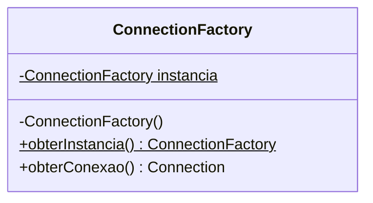
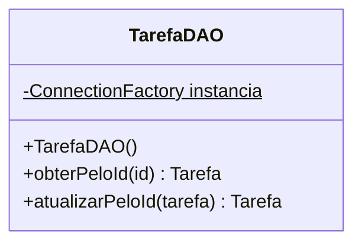

# JDBC
Repositório com exemplos de utilização da API de conectividade com banco de dados JDBC

## Drivers de Conexões

| Banco de Dados | Maven |
|----------------|-------|
| SQLite         |  https://mvnrepository.com/artifact/org.xerial/sqlite-jdbc     |
| MySql          |   https://mvnrepository.com/artifact/mysql/mysql-connector-java     |
| Postgree       |  https://mvnrepository.com/artifact/org.postgresql/postgresql    |

## Strings de Conexões

| Banco de Dados | Maven |
|----------------|-------|
| SQLite         |  ```jdbc:sqlite:nome_do_banco.db``` |
| MySql          |  ```jdbc:mysql://<database_host>:<port>/<database_name> ``` |
| Postgree       |  ```jdbc:postgresql://<database_host>:<port>/<database_name> ``` |


## Fábrica de conexões

A fábrica de conexões é uma classe que lida com a criação de conexões com o banco de dados. Esta classe que conhece qual o tipo de de banco de dados e configurações de acesso. A fábrica de conexões faz uso de dois *design patterns*, [factory method](https://refactoring.guru/pt-br/design-patterns/factory-method) e [singleton](https://refactoring.guru/pt-br/design-patterns/singleton).




```java
class ConnectionFactory {

    private  static ConnectionFactory instancia;

    private ConnectionFactory(){

    }

    public static ConnectionFactory obterInstancia(){
        if(instancia == null){
            instancia = new ConnectionFactory();
        }
        return instancia;
    }

    public Connection obterConexao(){
        try{
            Connection conn = DriverManager.getConnection("jdbc:sqlite:meu_banco_de_dados.db");
            return conn;
        }catch (Exception e){
            e.printStackTrace();
        }
        throw new RuntimeException("Não foi possível conectar ao banco de dados.");
    }


}
```

## Data Access Object, DAO

Objeto de acesso a dados é um padrão utilizado para separar as regras de negócios das regras de acesso ao banco de dados. Nessa classe é realizado o mapeamento de objetos para tipos de dados SQL e vice-versa.


