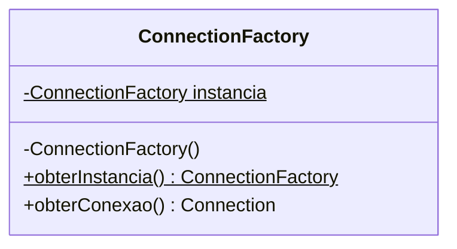
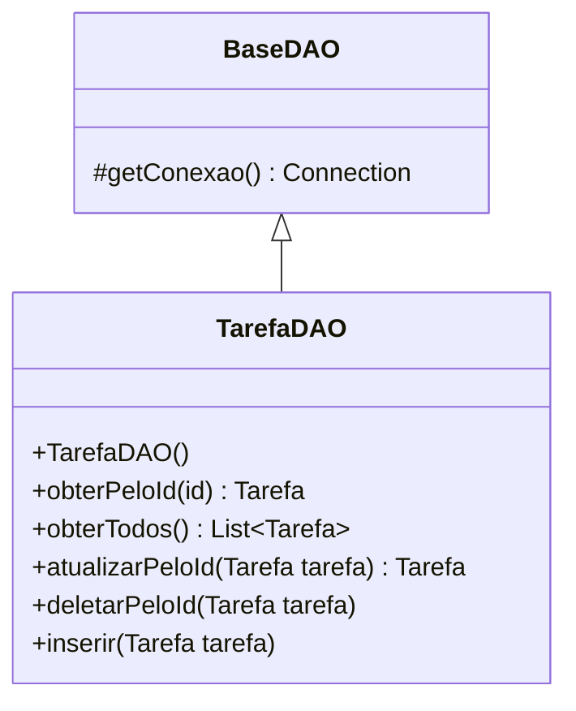

# JDBC
Repositório com exemplos de utilização da API de conectividade com banco de dados JDBC

## Drivers de Conexões

| Banco de Dados | Maven |
|----------------|-------|
| SQLite         |  https://mvnrepository.com/artifact/org.xerial/sqlite-jdbc     |
| MySql          |   https://mvnrepository.com/artifact/mysql/mysql-connector-java     |
| Postgree       |  https://mvnrepository.com/artifact/org.postgresql/postgresql    |

## Strings de Conexões

| Banco de Dados | Maven |
|----------------|-------|
| SQLite         |  ```jdbc:sqlite:nome_do_banco.db``` |
| MySql          |  ```jdbc:mysql://<database_host>:<port>/<database_name> ``` |
| Postgree       |  ```jdbc:postgresql://<database_host>:<port>/<database_name> ``` |


## Fábrica de conexões

A fábrica de conexões é uma classe que lida com a criação de conexões com o banco de dados. Esta classe que conhece qual o tipo de de banco de dados e configurações de acesso. A fábrica de conexões faz uso de dois *design patterns*, [factory method](https://refactoring.guru/pt-br/design-patterns/factory-method) e [singleton](https://refactoring.guru/pt-br/design-patterns/singleton).




```java
class ConnectionFactory {

    private  static ConnectionFactory instancia;

    private ConnectionFactory(){

    }

    public static ConnectionFactory obterInstancia(){
        if(instancia == null){
            instancia = new ConnectionFactory();
        }
        return instancia;
    }

    public Connection obterConexao(){
        try{
            Connection conn = DriverManager.getConnection("jdbc:sqlite:meu_banco_de_dados.db");
            return conn;
        }catch (Exception e){
            e.printStackTrace();
        }
        throw new RuntimeException("Não foi possível conectar ao banco de dados.");
    }


}
```

## Data Access Object, DAO

Objeto de acesso a dados é um padrão utilizado para separar as regras de negócios das regras de acesso ao banco de dados. Nessa classe é realizado o mapeamento de objetos para tipos de dados SQL e vice-versa.



A classe BaseDAO possui apenas um método de solicitar uma nova conexão ao banco de dados. Esta classe evita a dependência da ConnectionFactory em diferentes classes DAOs.

```java 
class BaseDAO {

    protected Connection getConexao(){
        return ConnectionFactory.obterInstancia().obterConexao();
    }

}
```

A classe TarefaDAO possui todas as operações necessárias para manipular os dados da tabela DAO.

```java
package br.univille.poo.jdbc.dao;

import java.sql.Connection;
import java.sql.PreparedStatement;
import java.sql.ResultSet;
import java.sql.SQLException;
import java.util.ArrayList;
import java.util.List;

public class TarefaDAO extends BaseDAO{

    private final static String COLUNA_DESCRICAO = "descricao";
    private final static String COLUNA_ID = "id";
    protected final static String CREATE_TABLE = """
            CREATE TABLE IF NOT EXISTS  tarefa  (
            	"id"	INTEGER UNIQUE,
            	"descricao"	TEXT,
            	PRIMARY KEY("id" AUTOINCREMENT)
            );""";


    public TarefaDAO(){

    }

    public Tarefa obterPeloId(int id) {
        String sql = "select id, descricao from tarefa where id = ?";
        try(Connection c = getConexao();
            PreparedStatement p = c.prepareStatement(sql)){
            p.setInt(1,id);
            ResultSet resultset = p.executeQuery();
            if (resultset.next()){
                return mapearResultSetParaTarefa(resultset);
            }
        } catch (SQLException e) {
            e.printStackTrace();
            System.out.println("Erro ao obter tarefa pelo id "+id);
        }
        return null;
    }

    public Tarefa inserir(Tarefa tarefa) {
        String sql = "insert into tarefa(descricao) values (?)";
        try(Connection c = getConexao();
            PreparedStatement p = c.prepareStatement(sql)){
            p.setString(1,tarefa.getDescricao());
            p.execute();
        } catch (SQLException e) {
            e.printStackTrace();
            System.out.println("Erro ao inserir tarefa pelo id");
        }
        return null;
    }

    public List<Tarefa> obterTodos() {
        String sql = "select id, descricao from tarefa";
        List<Tarefa> lista = new ArrayList<>();
        try(Connection c = getConexao();
            PreparedStatement p = c.prepareStatement(sql)){
            ResultSet resultset = p.executeQuery();
            while (resultset.next()){
                Tarefa tarefa = mapearResultSetParaTarefa(resultset);
                lista.add(tarefa);
            }
        } catch (SQLException e) {
            e.printStackTrace();
            System.out.println("Erro ao obter todas as tarefas ");
        }
        return lista;
    }

    public Tarefa atualizarPeloId(Tarefa tarefa) {
        String sql = "update tarefa set descricao = ? where id = ?";
        try(Connection c = getConexao();
            PreparedStatement p = c.prepareStatement(sql)){
            p.setString(1,tarefa.getDescricao());
            p.setInt(2,tarefa.getId());
            p.execute();
            return obterPeloId(tarefa.getId());
        } catch (SQLException e) {
            e.printStackTrace();
            System.out.println("Erro ao atualizar tarefa pelo id "+tarefa.getId());
        }
        return null;
    }

    public void deletarPeloId(Tarefa tarefa) {
        String sql = "delete from tarefa  where id = ?";
        try(Connection c = getConexao();
            PreparedStatement p = c.prepareStatement(sql)){
            p.setInt(1,tarefa.getId());
            p.execute();
        } catch (SQLException e) {
            e.printStackTrace();
            System.out.println("Erro ao deletar tarefa pelo id "+tarefa.getId());
        }
    }

    private Tarefa mapearResultSetParaTarefa(ResultSet result) throws SQLException {
        Tarefa tarefa = new Tarefa();
        tarefa.setDescricao(result.getString(COLUNA_DESCRICAO));
        tarefa.setId(result.getInt(COLUNA_ID));
        return tarefa;
    }


}

```

